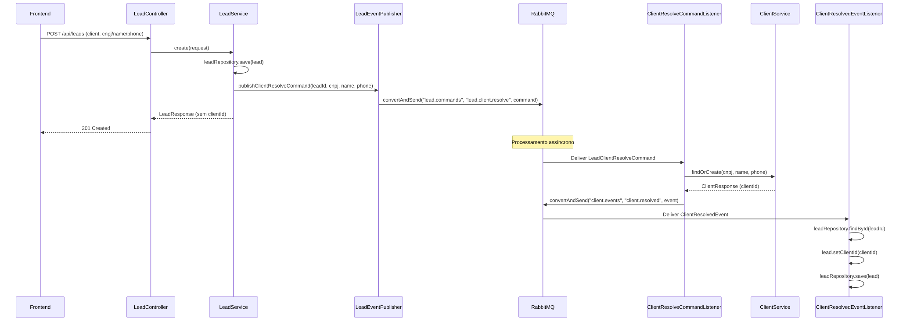
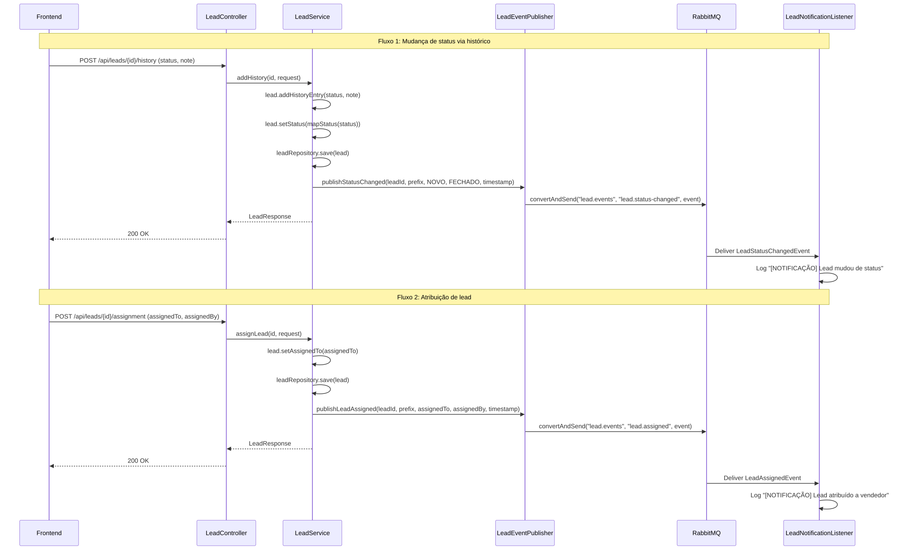
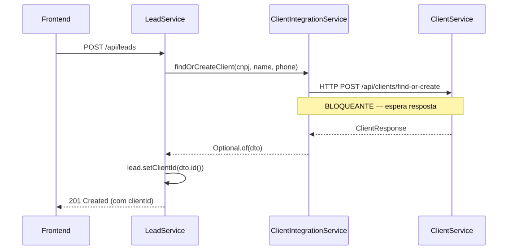
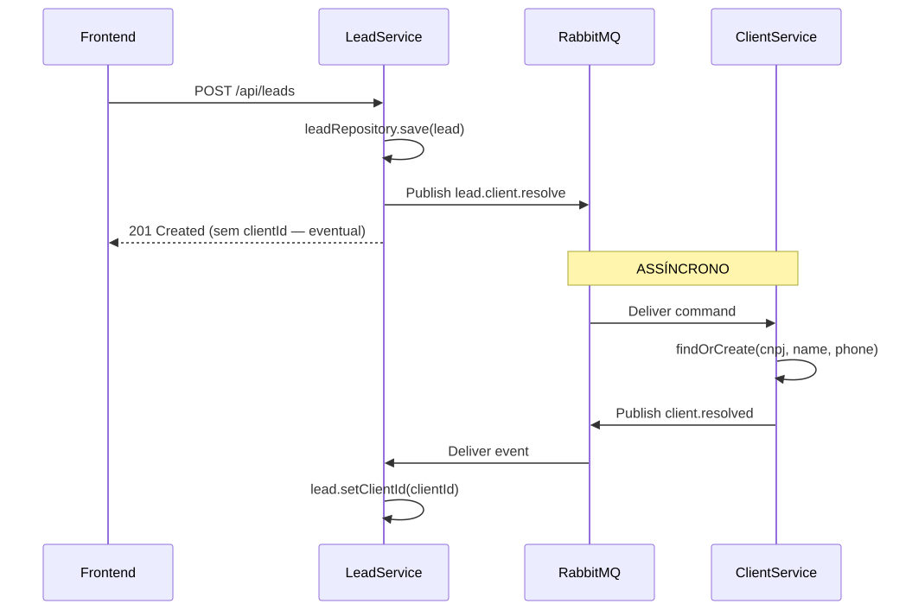

# Arquitetura Orientada a Eventos — Refatoração com RabbitMQ (TP4)

Neste trabalho (TP4), refatorei o sistema Diamond Aviação para substituir as chamadas REST síncronas entre os serviços por uma **arquitetura orientada a eventos (EDA)**, utilizando o **RabbitMQ** como message broker e aproveitando as abstrações fornecidas pelo **Spring Boot AMQP**.

---

## 1. Avaliação da Arquitetura Orientada a Eventos: Prós e Contras

Antes de iniciar a refatoração, avaliei os impactos da mudança de paradigma. A migração de um acoplamento síncrono (OpenFeign) para mensageria assíncrona traz ganhos expressivos, mas também impõe contrapartidas que precisei tratar no design da solução.

### Prós

| Vantagem | O que significa na prática | Como comprovei no meu sistema |
|----------|----------------------------|-------------------------------|
| **Desacoplamento temporal** | O produtor não precisa que o consumidor esteja online no momento do disparo. | No `LeadService`, quando crio um lead, publico o comando e retorno HTTP 201 imediatamente. O `client-service` pode até estar reiniciando que a criação não falha. |
| **Escalabilidade independente** | Produtores e consumidores podem ser dimensionados em ritmos distintos. | Se houver uma enxurrada de novos leads cadastrados, posso subir múltiplas instâncias do `client-service` concorrendo pela fila `client.resolve.queue` sem alterar o serviço de leads. |
| **Resiliência e tolerância a falhas** | O broker atua como um buffer durável contra indisponibilidades. | Se o `client-service` cair, as mensagens ficam retidas com segurança na fila do RabbitMQ e são processadas automaticamente assim que o serviço voltar ao ar. |
| **Extensibilidade** | Novos módulos podem reagir a fatos do sistema sem tocar no código existente. | Criei eventos como `lead.status-changed`. Se amanhã eu quiser plugar um serviço de envio de WhatsApp ou CRM externo, basta criar um novo listener conectado ao exchange, sem mudar uma linha do `LeadService`. |
| **Tempo de resposta reduzido** | A requisição HTTP do usuário não fica travada aguardando processamento secundário. | O endpoint `POST /api/leads` não perde mais tempo esperando a resolução remota do cliente, respondendo mais rápido ao frontend. |

### Contras e Desafios Reais

| Desvantagem | Impacto no desenvolvimento | Como tratei na minha implementação |
|-------------|----------------------------|-----------------------------------|
| **Consistência eventual** | O dado não reflete instantaneamente em todas as pontas. | Ao cadastrar um lead, o campo `clientId` volta `null` na resposta imediata e é preenchido segundos depois via evento. Modelei o frontend e as consultas para aceitar os dados em trânsito com fallback seguro. |
| **Complexidade de infraestrutura** | Mais uma peça de infraestrutura para configurar, monitorar e manter. | Configurei um `docker-compose.yml` padronizado para subir o RabbitMQ com o plugin de Management ativo, facilitando o diagnóstico das filas na porta `15672`. |
| **Rastreabilidade e depuração** | Não existe uma stack trace única conectando a requisição à execução final. | Incluí logs contextualizados com identificadores de negócio (`leadId`, `cnpj`, routing key) em cada ponto de publicação e consumo de mensagens. |
| **Risco de loops e duplicações** | Redistribuição de mensagens com falha pode gerar processamentos repetidos. | Garanti idempotência na camada de negócio: o método `findOrCreate` do `ClientService` consulta o CNPJ antes de qualquer inserção. |

### Onde a Arquitetura Orientada a Eventos se destacou no projeto

- **Operações de escrita entre fronteiras de domínio:** O cadastro de um lead não deve ser abortado caso o cadastro mestre de clientes esteja com lentidão temporária. A fila garante entrega garantida.
- **Disseminação de notificações:** Mudanças de status e atribuição de vendedor interessam a múltiplos subsistemas (auditoria, métricas, notificações). O modelo Publish/Subscribe com Topic Exchange atende perfeitamente esse caso.

### Onde optei por NÃO usar eventos (Decisão Arquitetural Consciente)

- **Consulta imediata de dados (Query síncrona):** No endpoint `GET /api/leads/{id}/client`, o usuário clica no botão "Ver ficha do cliente" e precisa visualizar os dados detalhados na hora. Usar eventos aqui criaria uma complexidade desnecessária de Request-Reply assíncrono. Por isso, **mantive o OpenFeign para essa consulta síncrona específica**, demonstrando uma arquitetura híbrida equilibrada.

---

## 2. Padrões de Mensagens Implementados

Para cobrir diferentes necessidades da aplicação, implementei **três padrões clássicos de mensageria**, utilizando recursos distintos do RabbitMQ:

### 2.1 Command Message — `lead.client.resolve`

- **Conceito:** Representa uma solicitação explícita de ação enviada a um destinatário específico ("por favor, resolva/cadastre este cliente").
- **Caso de uso:** Ao criar ou atualizar um lead, o `LeadService` envia esse comando para que o `client-service` execute o `findOrCreate`.
- **Topologia RabbitMQ:**
  - **Exchange:** `lead.commands` (tipo **Direct**, pois o comando tem um destino bem delimitado)
  - **Routing Key:** `lead.client.resolve`
  - **Fila:** `client.resolve.queue`



---

### 2.2 Event Notification — `lead.status-changed` e `lead.assigned`

- **Conceito:** Mensagem compacta que apenas comunica que um fato relevante aconteceu no domínio, permitindo que qualquer interessado reaja.
- **Caso de uso:** Quando um vendedor adiciona um histórico comercial (mudando o status do lead) ou quando o lead é atribuído a outro atendente.
- **Topologia RabbitMQ:**
  - **Exchange:** `lead.events` (tipo **Topic**, permitindo roteamento flexível por padrões como `lead.#`)
  - **Routing Keys:** `lead.status-changed` e `lead.assigned`
  - **Fila:** `lead.notifications.queue` (vinculada via `lead.#` para concentrar eventos de auditoria e telemetria)



---

### 2.3 Event-Carried State Transfer — `client.resolved`

- **Conceito:** O evento carrega consigo todo o payload de dados necessário para que o consumidor atualize seu estado local sem precisar bater de volta no produtor via HTTP.
- **Caso de uso:** O `client-service`, após persistir/encontrar o cliente, emite o evento `client.resolved` contendo o `leadId`, o novo `clientId` gerado e o `cnpj`. O `LeadService` apenas consome esse evento e grava o `clientId` diretamente no banco H2.
- **Topologia RabbitMQ:**
  - **Exchange:** `client.events` (tipo **Topic**)
  - **Routing Key:** `client.resolved`
  - **Fila:** `lead.client.resolved.queue`

---

## 3. Topologia das Exchanges e Filas no RabbitMQ

Desenhei a topologia separando comandos de eventos e utilizando tipos de exchange condizentes com cada objetivo:



---

## 4. Visão Geral da Arquitetura do Sistema

A imagem abaixo ilustra a integração completa entre os microsserviços, o broker RabbitMQ, o Eureka Service Discovery e a camada de apresentação:



---

## 5. Comparativo: Antes (TP3 Síncrono) vs. Depois (TP4 Orientado a Eventos)

### Antes (TP3) — Acoplamento Síncrono com Feign
Na entrega anterior, o método `create()` do `LeadService` chamava diretamente o endpoint REST do `client-service`. Qualquer lentidão ou queda na rede travava a criação do lead:



### Depois (TP4) — Desacoplamento Assíncrono com RabbitMQ
Com a refatoração que realizei, o lead é salvo no banco local imediatamente e um comando é postado no RabbitMQ. A resposta volta ao cliente sem bloqueios. Quando o `client-service` conclui seu trabalho, ele notifica de volta e o lead é enriquecido com seu `clientId`:



---

## 6. Abstrações do Spring Boot Utilizadas

Utilizei o ecossistema do **Spring AMQP** para evitar código de baixo nível e manter a aplicação limpa e idiomática:

| Abstração Spring | Classe / Anotação no Projeto | Onde apliquei e por quê |
|------------------|------------------------------|--------------------------|
| `spring-boot-starter-amqp` | Dependência Maven | Adicionada nos POMs de ambos os serviços para auto-configuração de conexões. |
| `Jackson2JsonMessageConverter` | `@Bean` no `RabbitMQConfig` | Garante serialização e desserialização automática de Java Records para payloads JSON nas mensagens. |
| `RabbitTemplate` | Injetado no `LeadEventPublisher` e no `ClientResolveCommandListener` | Utilizei para publicar mensagens de forma simples com `convertAndSend(exchange, routingKey, payload)`. |
| `@RabbitListener` | Declarado nos métodos dos listeners | Consumo declarativo de filas, tratando conversão de tipo e confirmações automáticas de entrega (ACKs). |
| `QueueBuilder` e `BindingBuilder` | `@Bean` no `RabbitMQConfig` | Criação fluente e segura de filas duráveis e amarração às exchanges. |
| `DirectExchange` e `TopicExchange` | `@Bean` no `RabbitMQConfig` | Registro explícito das exchanges gerenciadas pelo Spring Container no RabbitMQ. |

---

## 7. Como Executar o Projeto

### Pré-requisitos
- Java 21 LTS
- Maven 3.9+
- Docker ou Colima (para executar o container do RabbitMQ)

### Execução Passo a Passo

```bash
# 1. Subir o RabbitMQ
docker compose up -d
# Interface de gerenciamento acessível em http://localhost:15672 (user: diamond, pass: diamond123)

# 2. Iniciar o Eureka Discovery Server
cd services/discovery-server
mvn spring-boot:run

# 3. Iniciar o Client Service (em outro terminal)
cd services/client-service
mvn spring-boot:run

# 4. Iniciar o Lead Service (em outro terminal)
cd backend-diamond-tp1
mvn spring-boot:run
```

---

## 8. Cenários Práticos de Demonstração

Para demonstrar a eficácia da arquitetura perante o avaliador, estruturei 4 cenários reproduzíveis:

1. **Cenário 1 — Criação Assíncrona e Resolução de Cliente:**
   - Disparo um `POST /api/leads`.
   - Constato nos logs o comando `lead.client.resolve` sendo publicado.
   - Observo o `client-service` processar o comando e responder com `client.resolved`.
   - Ao consultar `GET /api/leads/{id}`, o `clientId` já se encontra devidamente preenchido.

2. **Cenário 2 — Notificação de Transição de Status:**
   - Registro um atendimento comercial via `POST /api/leads/{id}/history` alterando o status para "Fechado".
   - O `LeadService` emite o evento `lead.status-changed`.
   - O `LeadNotificationListener` captura o evento via tópico `lead.#` e registra a auditoria.

3. **Cenário 3 — Notificação de Atribuição Comercial:**
   - Atribuo um lead a um vendedor via `POST /api/leads/{id}/assignment`.
   - O evento `lead.assigned` é propagado via Topic Exchange para o canal de notificações.

4. **Cenário 4 — Resiliência com Serviço Offline (Buffering no Broker):**
   - Interrompo o processo do `client-service` com `Ctrl+C`.
   - Crio um lead novo via `POST /api/leads`: a requisição tem sucesso imediato (HTTP 201).
   - Abro o RabbitMQ Management (`http://localhost:15672`) e mostro a mensagem retida na fila `client.resolve.queue` ("Ready: 1").
   - Subo novamente o `client-service`: a mensagem é consumida de imediato e o lead no banco é atualizado, provando a resiliência da fila.

---

## 9. Verificação e Testes Automatizados

Mantive a suíte de testes 100% verde em todos os módulos, adicionando testes unitários específicos para os novos listeners e publishers:

- **Lead Service:** 32 testes passando (18 de serviço com mocks do publisher, 7 de repositório, 5 de controller e 2 do listener de resolução).
- **Client Service:** 16 testes passando (7 de serviço, 5 de repositório, 3 de controller e 1 do listener de comandos).

Comandos para executar os testes:
```bash
# Testes do serviço principal de leads
mvn test

# Testes do serviço de clientes
cd services/client-service && mvn test
```
