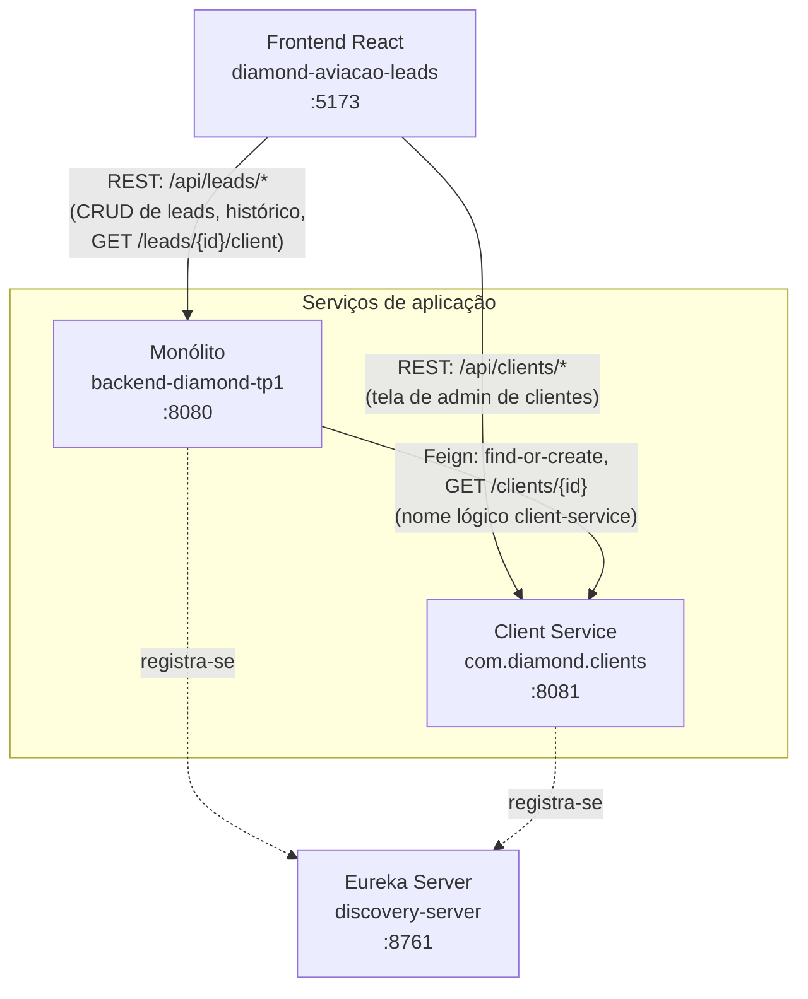
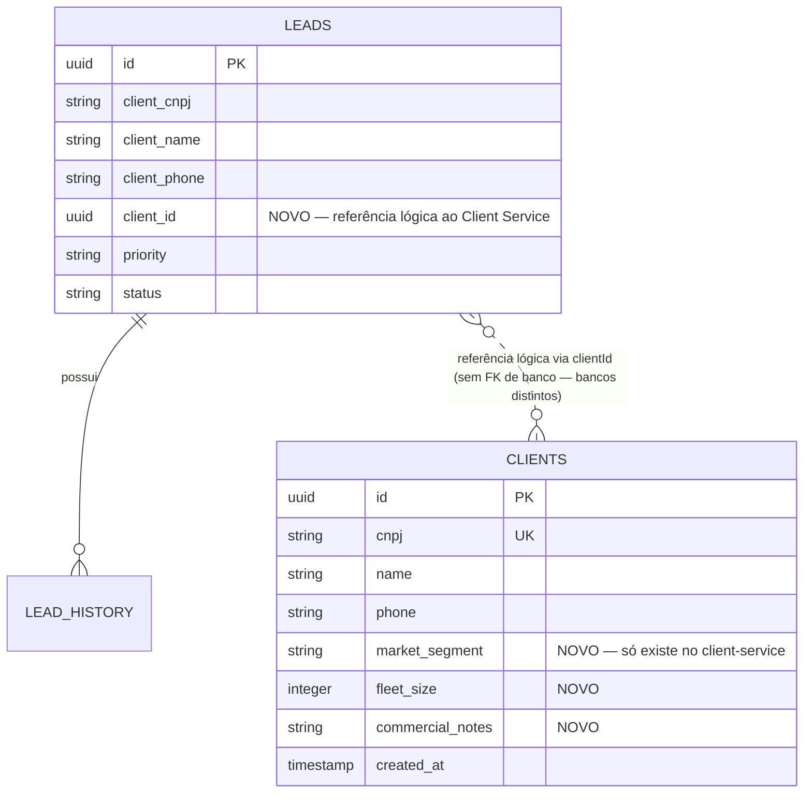
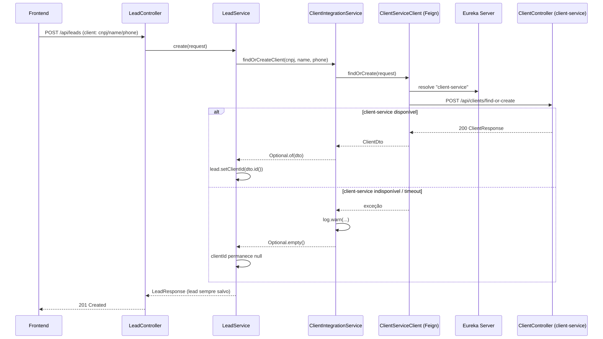
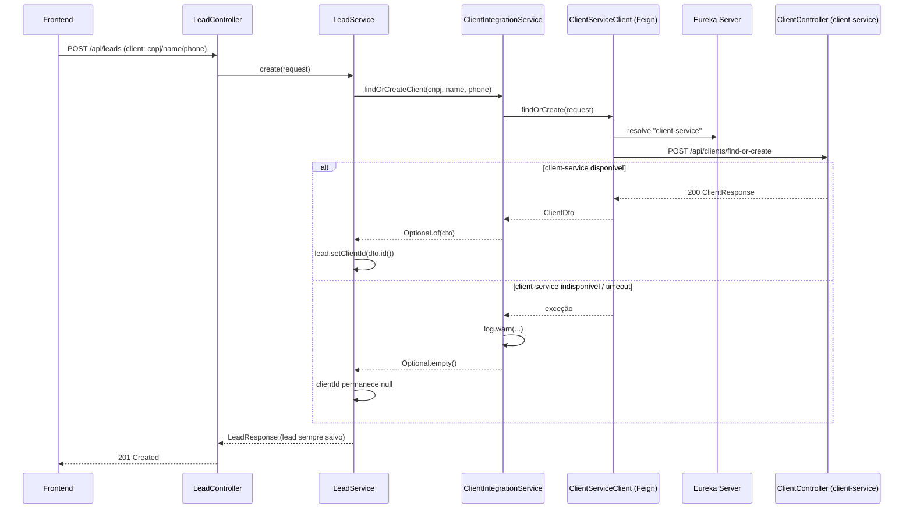
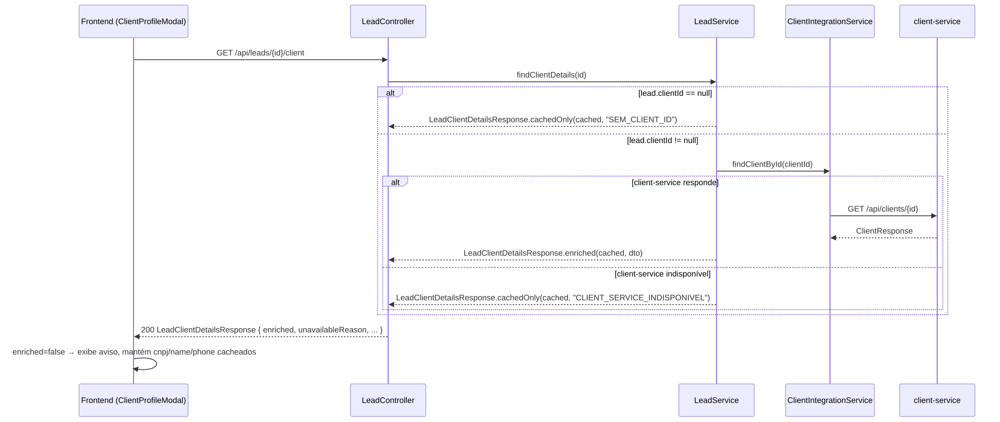
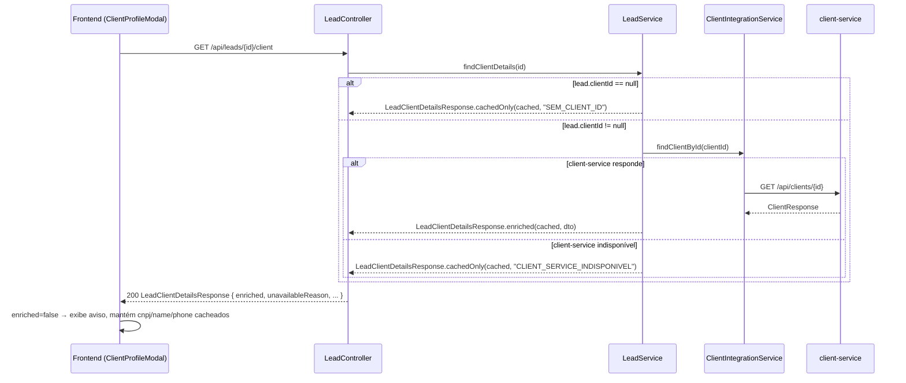

# Arquitetura — Microsserviço de Clientes (TP3)

## 1. Contexto e motivação

Nas etapas 1 e 2, o conceito de "Cliente" (CNPJ, nome, telefone) era um `@Embeddable` (`LeadClient`) embutido diretamente na entidade `Lead`, sem existência própria — não podia ser consultado, editado ou enriquecido independentemente do lead ao qual estava associado.

Esta etapa (TP3) extrai esse conceito para um **microsserviço dedicado — `client-service`** — dono de um cadastro mestre de cliente mais rico (segmento de mercado da aviação, tamanho de frota, observações comerciais), demonstrando separação de responsabilidades e comunicação distribuída entre serviços via **Spring Cloud (Eureka + OpenFeign)**.

A mudança é **aditiva**: `Lead.client` (o snapshot embutido de cnpj/name/phone) continua existindo, preservando o contrato JSON já consumido pelo frontend. `Lead` ganha apenas um novo campo `clientId`, referenciando o registro correspondente no `client-service`.

## 2. Componentes



<details><summary>Fonte Mermaid</summary>



</details>

- **discovery-server** (porta 8761): Eureka Server puro, sem lógica de negócio — só mantém o registro de instâncias de `backend-diamond-tp1` e `client-service`.
- **client-service** (porta 8081, pacote `com.diamond.clients`): dono do cadastro mestre de clientes. Banco H2 próprio em arquivo (`./data/diamond_clients`), independente do banco de leads. Expõe CRUD completo + endpoint `find-or-create`.
- **backend-diamond-tp1** (monólito, porta 8080): continua dono do domínio de leads/histórico. Passa a resolver o cliente de um lead via Feign, com fallback resiliente (try/catch) quando o `client-service` está indisponível.

## 3. Modelo de domínio



<details><summary>Fonte Mermaid</summary>



</details>

`clientId` é uma referência **lógica**, não uma foreign key de banco — `Lead` e `Client` vivem em bancos H2 separados, pertencentes a serviços diferentes. Essa é a diferença estrutural central em relação ao TP2, onde `LeadHistoryEntry` ganhou uma FK real dentro do mesmo banco.

## 4. Fluxo — criação/atualização de lead (find-or-create)



<details><summary>Fonte Mermaid</summary>



</details>

O lead **nunca deixa de ser criado** por causa de uma falha no `client-service` — essa é a garantia de resiliência central do design.

## 5. Fluxo — consulta da ficha enriquecida do cliente



<details><summary>Fonte Mermaid</summary>



</details>

## 6. Endpoints novos

### client-service (`/api/clients`, porta 8081)

| Método | Path | Descrição |
|---|---|---|
| GET | `/api/clients` | Lista todos os clientes |
| GET | `/api/clients/{id}` | Busca por id (404 se não existir) |
| GET | `/api/clients/by-cnpj/{cnpj}` | Busca por CNPJ (404 se não existir) |
| POST | `/api/clients` | Cria cliente (201 + Location) |
| PUT | `/api/clients/{id}` | Atualiza (não permite alterar CNPJ) |
| POST | `/api/clients/find-or-create` | Busca por CNPJ ou cria; usado pelo monólito via Feign |
| DELETE | `/api/clients/{id}` | Remove (204) |

### backend-diamond-tp1 (`/api/leads`, porta 8080)

| Método | Path | Descrição |
|---|---|---|
| GET | `/api/leads/{id}/client` | **Novo.** Retorna `LeadClientDetailsResponse`: dados cacheados do lead (cnpj/name/phone) + dados extras do client-service (marketSegment/fleetSize/commercialNotes) quando disponíveis. Campos `enriched: boolean` e `unavailableReason: "SEM_CLIENT_ID" \| "CLIENT_SERVICE_INDISPONIVEL" \| null` indicam a origem dos dados. |

`GET /api/leads` e `GET /api/leads/{id}` (já existentes) agora também retornam `clientId` em `LeadResponse` — mudança aditiva, não quebra o contrato consumido pelo frontend.

## 7. Frontend

- `src/features/clients/api.ts`: `fetchClientProfile` (chama o monólito), `listClients`/`createClient`/`updateClient`/`deleteClient` (chamam o client-service diretamente).
- `ClientProfileModal`: botão "Ver ficha do cliente" em `LeadCard`/`LeadTable` — mostra dados enriquecidos ou um aviso quando `enriched: false`, sem nunca bloquear o fluxo de registro de parecer do vendedor.
- `ClientsAdminPage` + `ClientFormModal`: tela `/gestao/clientes`, restrita ao perfil gestor, para o CRUD completo de clientes.

## 8. Como rodar localmente

Ordem recomendada (o Eureka client faz retry automático de registro, então a ordem não é rígida, mas evita erros de "no instances available" nas primeiras chamadas Feign):

```bash
# 1. Eureka Server — aguardar http://localhost:8761 responder
cd backend-diamond-tp1/services/discovery-server
mvn spring-boot:run

# 2. Client Service — aguardar :8081 e aparecer registrado no Eureka
cd backend-diamond-tp1/services/client-service
mvn spring-boot:run

# 3. Monólito — aguardar :8080 e aparecer registrado no Eureka
cd backend-diamond-tp1
mvn spring-boot:run

# 4. Frontend
cd diamond-aviacao-leads
npm run dev   # http://localhost:5173
```

## 9. Verificação manual realizada

1. `mvn test` em `services/discovery-server` (compile), `services/client-service` (15 testes) e na raiz do monólito (28 testes) — todos `BUILD SUCCESS`.
2. `npm run test` no frontend — 14 testes passando; `npx tsc -b` e `npm run build` sem erros.
3. Fluxo end-to-end: criação de lead gera cliente correspondente no client-service (find-or-create); ficha do cliente exibe dados enriquecidos; ao derrubar o client-service, a criação de lead continua funcionando normalmente e a ficha do cliente passa a exibir o aviso de dados indisponíveis (`unavailableReason: "CLIENT_SERVICE_INDISPONIVEL"`), sem quebrar a tela.
