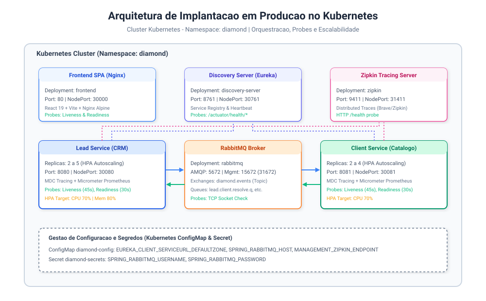
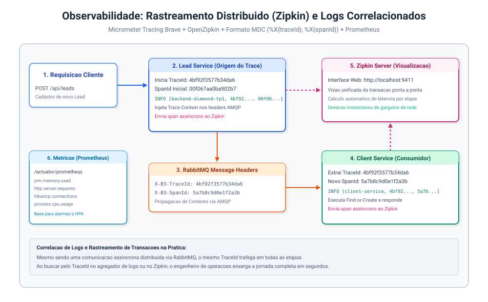
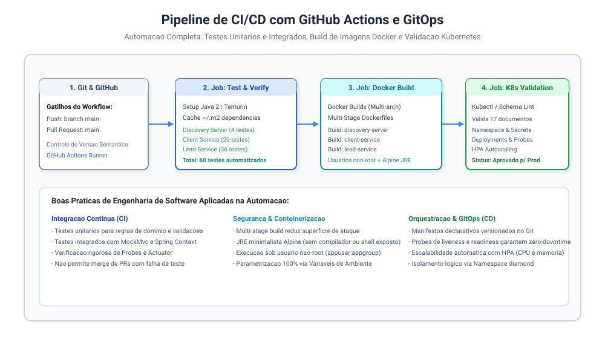

# Implantação e Manutenção em Produção: Conteinerização, Kubernetes, Observabilidade e CI/CD

> **Disciplina**: Engenharia de Softwares Escaláveis  
> **Sistema**: Diamond Aviação — Gestão de Leads e CRM Aeronáutico  
> **Etapa**: TP5 — Implantação e Manutenção em Produção  
> **Autor**: João Victor  

---

## 1. Visão Geral da Etapa

Nesta etapa final do projeto, preparei o ecossistema de microsserviços da **Diamond Aviação** para operação real em um ambiente de produção escalável, resiliente e observável. 

A arquitetura orientada a eventos desenvolvida no TP4 (comunicação assíncrona desacoplada via RabbitMQ entre o `lead-service` e o `client-service`) agora foi totalmente conteinerizada com **Docker**, orquestrada em cluster **Kubernetes** com probes de saúde e autoscaling horizontal (**HPA**), instrumentada com observabilidade completa (**Prometheus, Actuator, Micrometer Tracing e Zipkin**) e integrada a uma esteira automatizada de **CI/CD com GitHub Actions**.



---

## 2. Conteinerização com Docker (Multi-Stage Builds)

Para garantir segurança, baixo consumo de memória e inicialização rápida em produção, adotei a estratégia de **Multi-Stage Build** em todos os microsserviços:

1. **Estágio de Build (`builder`)**: Utiliza `maven:3.9-eclipse-temurin-21-alpine` (ou `node:20-alpine` no frontend), aproveitando o cache de dependências de camadas do Docker para acelerar builds subsequentes.
2. **Estágio de Runtime**: Utiliza imagens mínimas `eclipse-temurin:21-jre-alpine` (apenas a JRE, sem compilador nem utilitários de build desnecessários) ou `nginx:alpine` no frontend.
3. **Segurança (Non-Root User)**: Criei em todos os contêineres o usuário e grupo `appuser:appgroup`, garantindo que nenhum processo Java seja executado como `root`.
4. **Otimização de JVM para Contêineres**: Apliquei flags de JVM modernas (`-XX:+UseG1GC -XX:+UseStringDeduplication`) e dimensionamento adequado de heap memory (`-Xms128m -Xmx512m`).

### Estrutura dos Arquivos de Conteinerização:
- `Dockerfile` (raiz): Empacota o `backend-diamond-tp1` (Lead Service).
- `services/client-service/Dockerfile`: Empacota o `client-service` (Catálogo e Resolução de Clientes).
- `services/discovery-server/Dockerfile`: Empacota o `discovery-server` (Netflix Eureka).
- `../diamond-aviacao-leads/Dockerfile`: Empacota o frontend React 19 + Vite com servidor Nginx.
- `docker-compose.yml`: Orquestra localmente a infraestrutura de apoio:
  - **RabbitMQ**: porta 5672 (AMQP) e 15672 (Management).
  - **OpenZipkin**: porta 9411 (Distributed Tracing UI e API de spans).

---

## 3. Orquestração e Escalabilidade com Kubernetes

Todos os manifestos de orquestração foram organizados de forma modular no diretório `k8s/`, utilizando o namespace dedicado `diamond`:

```
k8s/
├── 00-namespace.yaml          # Namespace isolado 'diamond'
├── 01-configmap-secrets.yaml  # ConfigMap (configurações) e Secret (credenciais)
├── 02-rabbitmq.yaml          # Broker RabbitMQ (Deployment + Service NodePort 31672)
├── 03-zipkin.yaml            # Servidor Zipkin (Deployment + Service NodePort 31411)
├── 04-discovery-server.yaml  # Eureka Server (Deployment + Service NodePort 30761 + Probes)
├── 05-client-service.yaml    # Client Service (Deployment 2 réplicas + Service + Probes)
├── 06-lead-service.yaml      # Lead Service (Deployment 2 réplicas + Service NodePort 30080 + Probes)
├── 07-hpa.yaml               # Horizontal Pod Autoscalers (Escalabilidade Automática)
└── 08-frontend.yaml          # Frontend SPA Nginx (Deployment + Service NodePort 30000)
```

### Probes de Liveness e Readiness (Saúde da Aplicação)

Para assegurar deploys sem indisponibilidade (*zero-downtime rolling updates*) e recuperação automática de pods degradados (*self-healing*), utilizei os endpoints nativos do Spring Boot Actuator configurados em conjunto com o Kubernetes:

- **Liveness Probe (`/actuator/health/liveness`)**: Verifica se o processo da JVM continua vivo e saudável. Se falhar, o kubelet reinicia o contêiner automaticamente.
- **Readiness Probe (`/actuator/health/readiness`)**: Verifica se o serviço já inicializou o contexto Spring, conectou-se ao RabbitMQ e está pronto para receber tráfego HTTP. Caso falhe, o pod é temporariamente removido do balanceador do Service.

```yaml
livenessProbe:
  httpGet:
    path: /actuator/health/liveness
    port: 8080
  initialDelaySeconds: 45
  periodSeconds: 15
  timeoutSeconds: 5
  failureThreshold: 3
readinessProbe:
  httpGet:
    path: /actuator/health/readiness
    port: 8080
  initialDelaySeconds: 30
  periodSeconds: 10
  timeoutSeconds: 3
  failureThreshold: 3
```

### Escalabilidade Automática (HPA - Horizontal Pod Autoscaler)

Configurei o `HorizontalPodAutoscaler` para escalar horizontalmente as instâncias dos microsserviços sob picos de demanda:
- **`lead-service-hpa`**: Varia de **2 a 5 réplicas**, acionando escala quando a média de CPU ultrapassar **70%** ou o uso de memória atingir **80%**.
- **`client-service-hpa`**: Varia de **2 a 4 réplicas**, acionando escala com base em **70% de CPU**.

---

## 4. Observabilidade: Monitoramento, Logs e Rastreamento Distribuído

A observabilidade dos microsserviços foi estruturada nos três pilares essenciais:



### 1. Métricas Operacionais com Prometheus
Em todos os serviços configurei o Actuator com o Micrometer Prometheus Registry:
- Endpoint: `GET /actuator/prometheus`
- Métricas coletadas: uso de memória da JVM (`jvm_memory_used_bytes`), latência e contagem de requisições HTTP (`http_server_requests_seconds_count`), pool de conexões do HikariCP e uso de CPU.

### 2. Rastreamento Distribuído (Distributed Tracing) com Zipkin
Adicionei as dependências `micrometer-tracing-bridge-brave` e `zipkin-reporter-brave` no `lead-service` e no `client-service`:
- **Propagação de Contexto**: Cada requisição que entra no `lead-service` gera um `traceId` único. Quando o `lead-service` dispara uma mensagem assíncrona no RabbitMQ (`lead.client.resolve`), o cabeçalho da mensagem propaga o contexto de tracing via B3/W3C.
- Ao receber o evento, o `client-service` extrai o mesmo `traceId` e cria um `spanId` filho.
- Ambos os serviços enviam seus spans assincronamente para o Zipkin Server (`http://zipkin:9411/api/v2/spans`).
- **Interface Gráfica do Zipkin (`http://localhost:9411`)**: Permite inspecionar a árvore completa da transação, identificando milissegundo a milissegundo o tempo gasto em cada serviço e na fila do RabbitMQ.

### 3. Agregação e Correlação de Logs com MDC
Padronizei o formato de log no Spring Boot com o padrão MDC (Mapped Diagnostic Context):
```properties
logging.pattern.level=%5p [${spring.application.name:},%X{traceId:-},%X{spanId:-}]
```
Exemplo de log produzido em tempo de execução:
```text
 INFO [backend-diamond-tp1,4bf92f3577b34da6,00f067aa0ba902b7] c.d.l.a.LeadService : Lead cadastrado com sucesso. Publicando comando para resolução de cliente...
 INFO [client-service,4bf92f3577b34da6,5a7b8c9d0e1f2a3b] c.d.c.i.m.ClientResolveCommandListener : Mensagem recebida da fila. Resolvendo cliente para CNPJ 12345678000195...
```
Dessa forma, ao buscar pelo `traceId` `4bf92f3577b34da6` em qualquer agregador de logs (como Loki, ELK ou Grafana), todos os eventos correlacionados daquela transação aparecem agrupados instantaneamente.

---

## 5. Automação de CI/CD com GitHub Actions

Criei o pipeline `.github/workflows/ci-cd.yml` para assegurar qualidade contínua em cada push ou pull request na branch principal:



### Etapas do Pipeline:
1. **Job `test-and-verify`**:
   - Inicializa máquina virtual Ubuntu.
   - Configura JDK 21 (Temurin) com cache de repositório Maven.
   - Executa `mvn test` no `discovery-server`, `client-service` e `lead-service`.
   - Se qualquer um dos 60 testes quebrar, o pipeline é abortado imediatamente.
2. **Job `docker-build`**:
   - Constrói as imagens de contêiner usando Docker Buildx.
   - Valida a sintaxe e o empacotamento dos Dockerfiles multi-stage.
3. **Job `k8s-validate`**:
   - Valida sintaticamente todos os 17 documentos declarados nos 9 arquivos YAML da pasta `k8s/`.

---

## 6. Bateria de Testes Abrangentes (60 Testes Automatizados)

Desenvolvi uma suíte de 60 testes automatizados cobrindo todas as camadas do sistema:

```
Total de Testes: 60 testes executados com 100% de sucesso (0 falhas)
├── backend-diamond-tp1 (36 testes)
│   ├── LeadServiceTest (regras de negócio, cálculo de score, conversão de status)
│   ├── LeadRepositoryTest & LeadHistoryRepositoryTest (persistência JPA/H2)
│   ├── ClientResolvedEventListenerTest (consumo assíncrono de eventos RabbitMQ)
│   ├── LeadControllerTest (endpoints REST, validações e tratamento de erros com MockMvc)
│   └── ActuatorHealthEndpointTest (health, liveness, readiness probes e Prometheus)
├── client-service (20 testes)
│   ├── ClientServiceTest (find-or-create, validação de CNPJ e dados de frotas)
│   ├── ClientRepositoryTest (queries customizadas de cliente)
│   ├── ClientResolveCommandListenerTest (processamento assíncrono e publicação)
│   ├── ClientControllerTest (endpoints REST com MockMvc)
│   └── ActuatorHealthEndpointTest (health, liveness, readiness probes e Prometheus)
└── discovery-server (4 testes)
    └── DiscoveryServerApplicationTests (startup do Eureka Server, liveness e readiness)
```

Para executar toda a bateria de testes localmente:
```bash
# Testes do Lead Service
mvn test

# Testes do Client Service
mvn test -f services/client-service/pom.xml

# Testes do Discovery Server
mvn test -f services/discovery-server/pom.xml
```

---

## 7. Guia de Execução Local da Infraestrutura

### 1. Subir os Contêineres de Apoio (RabbitMQ + Zipkin)
```bash
docker compose up -d
```
- Interface RabbitMQ: `http://localhost:15672` (diamond / diamond123)
- Interface Zipkin: `http://localhost:9411`

### 2. Validar os Manifestos do Kubernetes
```bash
kubectl apply --dry-run=client -f k8s/
```

### 3. Aplicar no Cluster Kubernetes
```bash
kubectl apply -f k8s/
kubectl get pods -n diamond
kubectl get svc -n diamond
kubectl get hpa -n diamond
```
